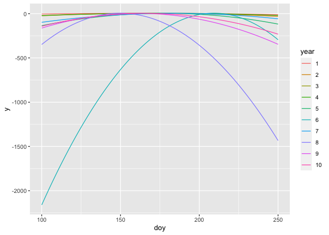

<!-- README.md is generated from README.Rmd. Please edit that file -->

# phenomix

R package for fitting distributions to run timing data via maximum
likelihood

[](https://github.com/nwfsc-cb/phenomix/actions)

pkgdown site: <https://nwfsc-cb.github.io/phenomix/>

### DOI

The DOI for this repository is
[](https://zenodo.org/doi/10.5281/zenodo.4435275)

## Installation

You can install phenomix with:

``` r
remotes::install_github("nwfsc-cb/phenomix",build_vignettes = TRUE)
#> Downloading GitHub repo nwfsc-cb/phenomix@HEAD
#> 
#> ── R CMD build ─────────────────────────────────────────────────────────────────
#>      checking for file ‘/private/var/folders/ts/4x6hzmfx7d52vbhjqmrs_3pw0000gp/T/RtmpjBCVFK/remotes161f77702fa38/nwfsc-cb-phenomix-a46f4fc/DESCRIPTION’ ...  ✔  checking for file ‘/private/var/folders/ts/4x6hzmfx7d52vbhjqmrs_3pw0000gp/T/RtmpjBCVFK/remotes161f77702fa38/nwfsc-cb-phenomix-a46f4fc/DESCRIPTION’
#>   ─  preparing ‘phenomix’:
#>      checking DESCRIPTION meta-information ...  ✔  checking DESCRIPTION meta-information
#>   ─  cleaning src
#>   ─  installing the package to build vignettes
#>      creating vignettes ...  ✔  creating vignettes (1m 34.3s)
#>   ─  cleaning src
#>   ─  checking for LF line-endings in source and make files and shell scripts
#>   ─  checking for empty or unneeded directories
#>   ─  building ‘phenomix_1.0.4.tar.gz’
#>      
#> 
```

Load libraries

``` r
library(phenomix)
library(ggplot2)
#> Warning: package 'ggplot2' was built under R version 4.3.2
```

## Functions

The package pheomix provides a suite of curve fitting to describe data
that may be generated from a process when distributions in time might be
concentrated (from fisheries, this occurs with counts over time of
salmon returning from the ocean to spawn or juvenile fish emigrating
from streams to the ocean).

<figure>

<figcaption aria-hidden="true">Predicted (black line) and observed
counts (red dots) for hypothetical dataset. Multiple observations may
exist for some days, or no observations on others.</figcaption>
</figure>

In a given year, the curve might be described by a symmetric or
asymmetric Gaussian or Student-t distribution (shown here in log-scale
on the y-axis). Questions of interest might be - are the means (x-axis)
shifting through time? - are the variances shifting through time? - does
the model support a symmetric or asymmetric distribution?

<!-- -->

## Examples

The main functions are `create_data()` and `fit()`. See `?create_data`
and `?fit` for additional details and examples. A vignette includes
additional detail, and examples of several models as well as function
arguments available <https://nwfsc-cb.github.io/phenomix/>.

## References

For description of fisheries applications of asymmetric models:

Methot, R.D. 2000. Technical description of the stock synthesis
assessment program. U.S. Dept. Commer., NOAA Tech. Memo. NMFS-NWFSC-43,
46
p. [link](https://repository.library.noaa.gov/view/noaa/3172/noaa_3172_DS1.pdf)

For statistical background of asymmetric models:

Rubio, F.J. and Steel, M.F.J. 2020. The family of two-piece
distributions. Significance, 17(1) 120–13.
[link](https://rss.onlinelibrary.wiley.com/doi/full/10.1111/j.1740-9713.2020.01352.x)

Wallis, K.F. 2014. The two-piece normal, binormal, or double Gaussian
distribution: Its origin and rediscoveries. Statistical Science, 29(1),
106–112. [link](https://arxiv.org/abs/1405.4995)

## NOAA Disclaimer

This repository is a scientific product and is not official
communication of the National Oceanic and Atmospheric Administration, or
the United States Department of Commerce. All NOAA GitHub project code
is provided on an ‘as is’ basis and the user assumes responsibility for
its use. Any claims against the Department of Commerce or Department of
Commerce bureaus stemming from the use of this GitHub project will be
governed by all applicable Federal law. Any reference to specific
commercial products, processes, or services by service mark, trademark,
manufacturer, or otherwise, does not constitute or imply their
endorsement, recommendation or favoring by the Department of Commerce.
The Department of Commerce seal and logo, or the seal and logo of a DOC
bureau, shall not be used in any manner to imply endorsement of any
commercial product or activity by DOC or the United States Government.


[U.S. Department of Commerce](https://www.commerce.gov/) \| [National
Oceanographic and Atmospheric Administration](https://www.noaa.gov) \|
[NOAA Fisheries](https://www.fisheries.noaa.gov/)
