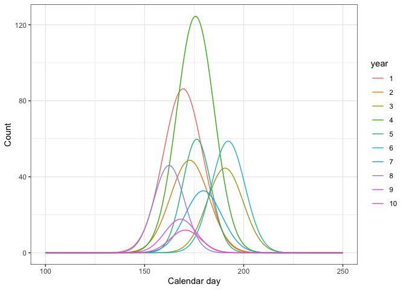

<!-- README.md is generated from README.Rmd. Please edit that file -->

# salmix

R package for fitting distributions to run timing data via maximum
likelihood

[](https://github.com/ericward-noaa/salmix/actions)

## Installation

You can install salmix with:

``` r
devtools::install_github("ericward-noaa/salmix",build_vignettes = TRUE)
```

Load libraries

``` r
library(salmix)
library(ggplot2)
```

## Functions

The package salmix provides a suite of curve fitting to describe data
that may be generated from a process when distributions in time might be
concentrated (from fisheries, this occurs with counts over time of
salmon returning from the ocean to spawn or juvenile fish emigrating
from streams to the ocean).


In a given year, the curve might be described by a symmetric or
asymmetric Gaussian or Student-t distribution (shown here in log-scale
on the y-axis). Questions of interest might be - are the means (x-axis)
shifting through time? - are the variances shifting through time? - does
the model support a symmetric or asymmetric distribution?

<!-- -->

## Examples

The main functions are `create_data()` and `fit()`. See `?create_data`
and `?fit` for additional details and examples. A vignette includes
additional detail, and examples of several models as well as function
arguments available
[here](https://github.com/ericward-noaa/salmix/tree/master/vignettes).
